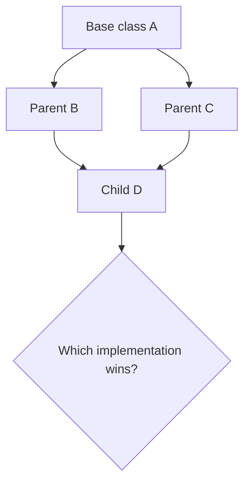

# Python vs Java — Multiple Inheritance


> A practical, code-first comparison of multiple inheritance in Python and Java.

This repository explains why Python allows a class to inherit from multiple classes, how Python resolves the Diamond Problem through **MRO** and **C3 Linearization**, and why Java deliberately limits class inheritance while supporting multiple interfaces.

The goal is not only to show syntax. Each example is small, executable, and connected to the design decisions behind both languages.

---

## The central question

What should happen when two parent classes provide the same method?



Python answers this with a deterministic method lookup order called **MRO**. Java avoids multiple class inheritance and uses explicit interface conflict resolution instead.

---

## What you will learn

| Topic | Python | Java |
|---|---|---|
| Multiple class inheritance | Supported | Not supported |
| Multiple interface inheritance | Supported through classes and mixins | Supported |
| Diamond Problem | Resolved through MRO / C3 | Conflicts must be resolved explicitly |
| `super()` | Follows the next class in the MRO | Targets a superclass or named interface |
| Default method conflict | MRO determines the next implementation | Implementing class must override |
| Common alternative | Composition and mixins | Composition and interfaces |

---

## Repository map

```text
.
├── python/
│   ├── 01_basic_multiple_inheritance.py
│   ├── 02_diamond_problem.py
│   ├── 03_mro_and_super.py
│   ├── 04_method_conflicts.py
│   ├── 05_cooperative_mixins.py
│   └── 06_composition_over_inheritance.py
├── java/
│   ├── 01_single_class_inheritance/
│   ├── 02_multiple_interfaces/
│   ├── 03_default_method_conflict/
│   └── 04_diamond_resolution/
├── docs/
│   └── python-vs-java.md
├── tests/
│   └── test_python_examples.py
└── README.md
```

---

## Python in one minute

Python permits multiple base classes:

```python
class Printable:
    def print_document(self):
        return "printing"


class Scannable:
    def scan_document(self):
        return "scanning"


class MultiFunctionPrinter(Printable, Scannable):
    pass
```

The lookup order is available at runtime:

```python
print(MultiFunctionPrinter.__mro__)
```

For a diamond such as `D(B, C)`, Python creates a consistent order similar to:

```text
D → B → C → A → object
```

`super()` means “continue to the next class in that order”; it does not simply mean “call my direct parent.”

Run the examples:

```bash
python python/01_basic_multiple_inheritance.py
python python/02_diamond_problem.py
python python/03_mro_and_super.py
```

---

## Java in one minute

Java permits one superclass:

```java
class Child extends Parent {
}
```

But Java also permits multiple interfaces:

```java
class Document implements Printable, Scannable {
}
```

If two interfaces provide the same `default` method, Java requires the implementing class to choose or provide an implementation:

```java
@Override
public void show() {
    Printable.super.show();
}
```

Compile and run an example from its directory:

```bash
cd java/03_default_method_conflict
javac DefaultMethodConflictDemo.java
java DefaultMethodConflictDemo
```

The Java examples require JDK 17 or newer.

---

## Why Java does not allow multiple class inheritance

The restriction is a deliberate language-design choice. Multiple classes can bring conflicting:

- method implementations;
- fields with the same name;
- constructors and initialization order;
- inherited state;
- assumptions about `super` calls.

Instead of making every class resolve these cases through a global lookup algorithm, Java keeps class inheritance single-parent and makes interface conflicts explicit at the point where they occur.

This is not because the problem is impossible to solve. It is because Java prioritizes a simpler object model and predictable class behavior.

---

## Recommended learning path

1. Start with `python/01_basic_multiple_inheritance.py`.
2. Run `python/02_diamond_problem.py` and inspect `__mro__`.
3. Study `python/03_mro_and_super.py` to see cooperative inheritance.
4. Compare the Python examples with `java/02_multiple_interfaces`.
5. Run the Java default-method conflict example.
6. Finish with composition in `python/06_composition_over_inheritance.py`.

---

## Tests

The Python examples are covered by lightweight standard-library tests:

```bash
python -m unittest discover -s tests -v
```

No third-party Python package is required.

---

## Design takeaway

Multiple inheritance is a tool, not a default architecture.

Use it when the relationships are genuinely compatible, especially for small stateless mixins. Prefer composition when objects have independent responsibilities or significant state. A design that is easy to explain is usually easier to test, extend, and debug.

---

## Further reading inside this repository

- [Detailed Python vs Java comparison](docs/python-vs-java.md)
- [Python examples](python/)
- [Java examples](java/)
- [Python tests](tests/test_python_examples.py)

---

## License

This project is licensed under the MIT License. See [LICENSE](LICENSE) for details.

